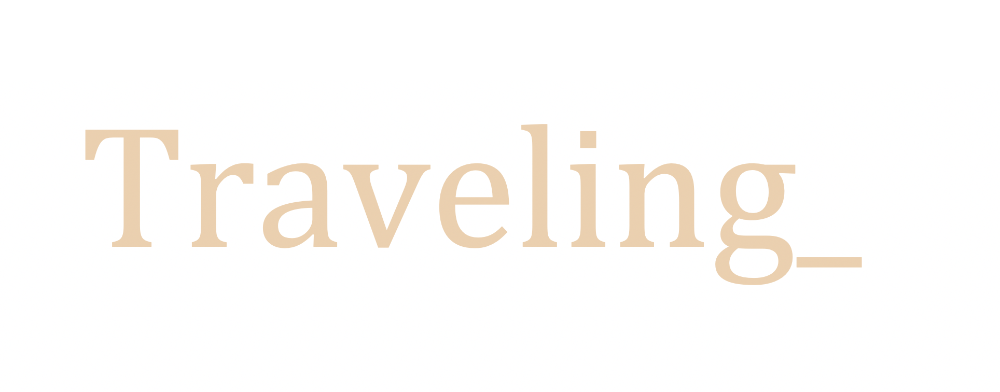
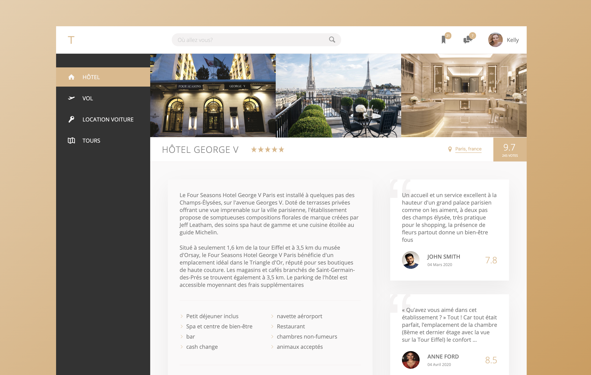
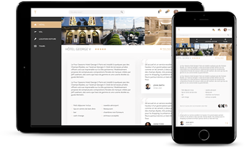

[](https://snyk.io/test/github/batouche-dev/advanced-css?targetFile=package.json)
[](https://www.codacy.com/manual/batouche-dev/advanced-css?utm_source=github.com&utm_medium=referral&utm_content=batouche-dev/advanced-css&utm_campaign=Badge_Grade)
[](https://github.com/prettier/prettier)



# Description

This project using html, saas, node (BEM, 7-1, etc.. ) to get a website design with flexbox

# ScreenShot



# Demo

To get the demo click of the website click here : [Traveling\_](https://batouche-dev.github.io/traveling-flexbox/) .

# Setup

first clone the project in your workspace with this command line

```
git clone https://github.com/batouche-dev/traveling-flexbox.git
```

# Launch

```
cd traveling-flexbox
```

and then open index.html file with any browser: chrome, firefox, safari ...

# Device


